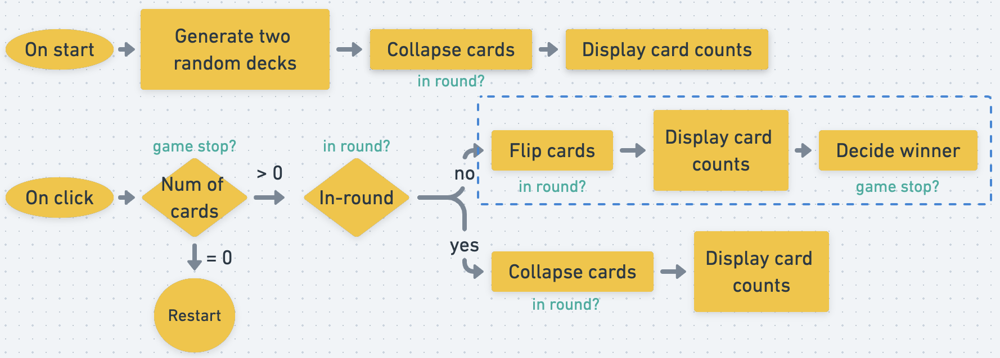

# Card Game

[]()

👆🏽 click to check the live page

This is a card game. You can play with the computer. Both decks will flip one card after clicking. Comparing the flipped card, the one with higher value and suit will get two flipped cards. The winner will get the whole deck cards.

## Demo


## How it's built

**Tech used**: HTML, CSS, JavaScript

### Design flow



## Lesson learnt

### Use data attribute as content for CSS

We can move small data to data attribute and then later make it content for CSS and style it. By using `attr(attribute-name)`, we can retrive the value from specified attribute. Using `[attribute-name]` as the CSS selector allow us to select the specific element.

```html
    <p data-text="Hello">World</p>
```

```css
    [data-text]::before{
        content: attr(data-text) " ",
    }
```
The result from above code will generate "Hello World".

**Note:** 

1. `attr()` can only be used in different properties but only in `content` property is robust. The other usages are still under experiment.   

2. We can change data attributes dynamically in JavaScript by `element.dataset.name` for attribute `data-name`.


Benefit of using data attribute as content for CSS:

1. Reduce the HTML code a lot

2. Allow dynamically change easily via JavaScript

### CSS grid

CSS grid can do the 2D layout efficiently. (Good to use with flexbox which is good with 1D layout.)

**Terminology:**

1. Grid container: `display: grid` is applied

2. Grid item (must be direct child of the container)

3. Grid line: there's column grid line and row grid line

4. Grid cell

5. Grid track: the area between two grid lines

6. Grid area: the area surrounded by four grid lines

**Important properties**

- For grid container

    1. `grid-template`: A shorthand for `grid-template-row` and `grid-template-column` and `grid-template-areas`
    ```css
        .container {
            grid-template:
                [row1-start] "header header header" 25px [row1-end]
                [row2-start] "footer footer footer" 25px [row2-end]
                / auto 50px auto;
        }
    ```   